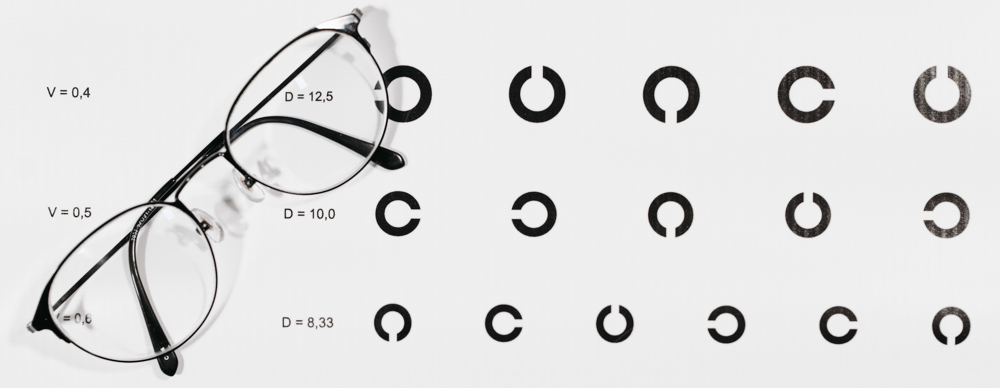
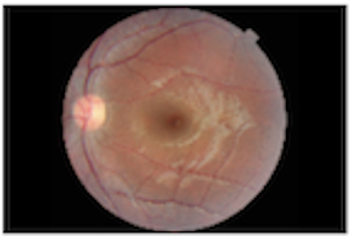
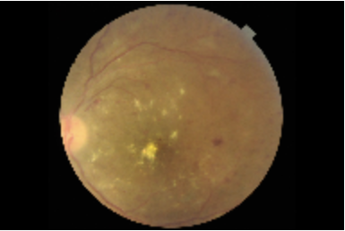
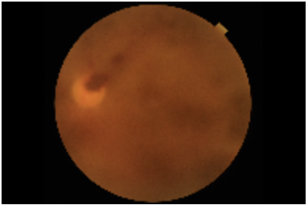
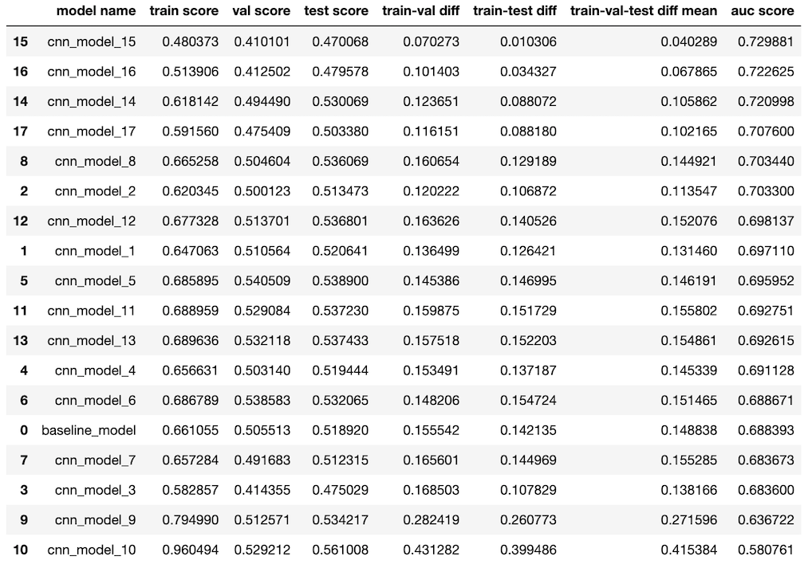
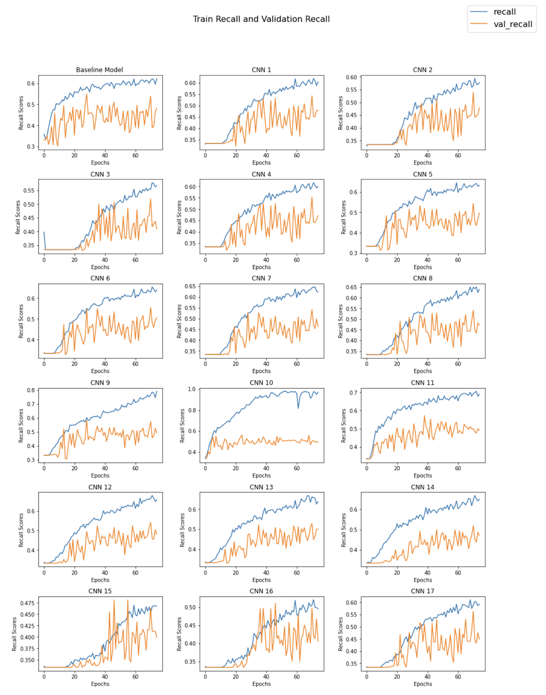
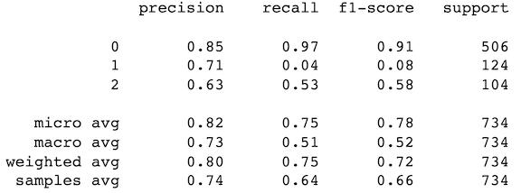
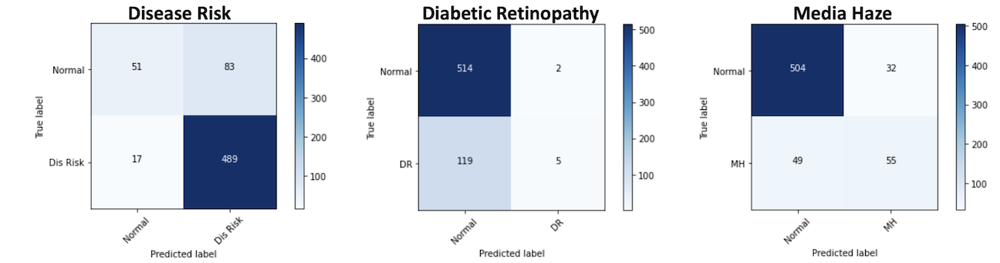

&emsp;&emsp;&emsp;&emsp;&emsp;&emsp;&emsp;&emsp;&emsp;&emsp;&emsp;&emsp;&emsp;&emsp;&emsp;&emsp;&emsp;&emsp;&emsp;&emsp;&emsp;&emsp;&emsp;


# Using a Convolutional Neural Network for Early Detection of Retinal Diseases

**Author:** Freddy Abrahamson<br>
**Date created:** 8-14-2022<br>
**Discipline:** Data Science
<br><br>

## Overview
***
For this project, I will be comparing different neural network models. I will start with a ANN as a baseline model, and then create CNN(s), to see which is the most successful. 
I have a data set of retinal images with different disease classifications. This is a multi-label set, so each image could be classified as having more than one disease. The goal for the model is to have the highest recall score. Effectively being able to correctly identify as many diseases that correspond to each image, while at the same time having a macro average of accuracy scores of at least 70% . 
***
### In order for the notebook to run successfully:

1. Download the data from https://www.kaggle.com/datasets/andrewmvd/retinal-disease-classification
2. The folder should be downloaded to the same directory as where your Jupyter notebook is located. The folder is called 'archive'.
3. In order to recreate the necessary python environment, the environment.yml has been uploaded to github.
4. The notebook was run on macOS Big Sur (version 11.6) 

## Business Problem
***
<b>Stakeholder:</b> The Board of directors of a national network of  eye hospitals.

<b>Business Problem:</b> The hospital is looking for a solution that would enable the early detection and diagnosis of ocular diseases.  

<b>Proposed Solution:</b> A machine learning model that could distinguish between the image of a healthy retina, and of an unhealthy one. It can also detect for media haze (cloudy vision), and diabetic retinopathy.

<b>Solution Benefits:</b><br>
               1. cost effective<br> 
               2. non-invasive<br>
               3. would enable doctors to more effectively prevent, treat, and forestall the onset of ocular diseases


## Data Understanding
***
The data was taken from Kaggle.com. There are a total of 3200 images depicting healthy retinas, or retinas with a particular disease . The dataset is split into 3 subsets: training 60% (1920 images), evaluation 20% (640 images), and test 20% (640 images) sets. Each patient could potentially have more than one condition. I chose to work with the disease classes that 'occurred' in the training set at least 300 times.  Based on this criteria I was working with three different classes:<br><br>
                                                   Disease_Risk:                    1519<br>
                                                   DR (diabetic retinopathy):       376<br>
                                                   MH (media haze):                 317<br>


## Modeling
***
I used Keras and Tensorflow to create the models. Given that with the use of the filters, cnn(s) excel at detecting features of various sizes,I chose to use the less apt multi-layer perceptron as a baseline model. My modeling process was the following:
1. I tried to overfit on purpose using a cnn. Eventhough I was trying to overfit, I was also checking to see if that rise in the training score had any impact on the validation score. I began with a cnn model that has 4 activation layers for the feature extraction part,with the number of nodes for each layer being 16,32,64, and 128 respectively. I used ReLu as my activation function for all feature detection, as well as for the classification layers. Given that this is a a multi-label problem, I used three sigmoid functions in the output layer; one representing each class.<br><br>
2. From there, when I was satisfied with the model architecture(number of layers, and number of nodes per layer), I  would try to reduce the variance by using different combinations of filter sizes, with the goal of making the model more generalizable.<br><br>
3. Once I was satisifed with the filters, I would apply an optimizer with different learning rates, to see if this would improve results, or give me additional information about where the line plots for the scores of the respective data sets stopped oscillating, and possibly reach their respective convergences'.<br><br>
4. After this, I would choose the best model amongst these and try to further reduce the variance by using some regularization technique, such as adding a dropout layer(s), or using L1, or L2 regularization. 

## Evaluation
***
Given the importance of early detection of potential ocular diseases, my primary goal was to find a model that produced the best recall scores. To this end, I used a custom metric, 'recall_macro'. This metric returns the macro average of the respective recall scores of each class. So in this case, the metric would take the recall score of each of the three classes, add them up, and divide by three. In order to find the best model I took several factors into consideration:<br>
1. I was looking for a model that would produce one of the best,if not the best, bias/variance combination between the train and test data sets. I did this by creating a function best_model(), which utilizes the auc() function from sklearn.metrics. The x-axis is represented by the absolute difference between the train and test scores, while the y-axis is represented by the test scores. The higher the test score, and the lower the train-test difference, the greater the area under the curve. The function returns a dataframe with the models, and their respective test scores, sorted by their auc. The model with the highest auc is the best.<br><br>
2. The difference between the train and validation scores was also important. Ideally there would be some uniformity across all three scores, <br><br>
3. I also look at the recall/epoch plots to see if the train/val scores line up with any possible information that can be inferred from the plots.<br><br>
The secondary goal was a model that would have a macro accuracy score of atleast 70%. To this end, I created a custom metric, 'acc_macro', which takes the accuracy scores for each individual class, and returns the macro average.


## Importing and Organizing Data
***
I will:

1. create a dataframe for each .csv file: training, validation, and testing. 
2. review all dataframes for: length, data types,missing data, etc.
3. check for labels that 'occur' atleast 300 times in the trainng dataframe, and create new datframes for each data-      set with only those labels.
4. Convert the new dataframes to numpy arrays.
5. Create an 'image array' for each dataframe, and use a loop to add the images referred to in each dataframe to its      corresponding array,as a collection of pixels, with each pixel being represented by three values (0-255),
   which represent the intensity of each respective color, red, green, and blue, for that pixel.
6. Normalize all the pixel values by dividing each by 255


## Viewing an image
***
Normal:<br>
&emsp;&emsp;&emsp;&emsp;&emsp;&emsp;&emsp;&emsp;&emsp;&emsp;&emsp;&emsp;&emsp;&emsp;&emsp;&emsp;&emsp;&emsp;<br><br>
Diabetic Retinopathy:<br>
&emsp;&emsp;&emsp;&emsp;&emsp;&emsp;&emsp;&emsp;&emsp;&emsp;&emsp;&emsp;&emsp;&emsp;&emsp;&emsp;&emsp;&emsp;<br><br>
Media Haze:<br>
&emsp;&emsp;&emsp;&emsp;&emsp;&emsp;&emsp;&emsp;&emsp;&emsp;&emsp;&emsp;&emsp;&emsp;&emsp;&emsp;&emsp;&emsp;<br><br>

# Choosing The Best Model

<b>After reviewing the 'Best Model' dataframe, and the train and recall validation plots below, there are a few major takeaways:<br>

* The model with the best train/test - bias/variance combination is model cnn-15, based on auc score. 
* Independent of the train score, after around epoch 40 the majority of scores fall between the low 40s and the low     50s, and there is an upward trend across all validation plots. 
* In cnn-10 using the ADAM optimizer with the default learning rate; with the training score at 96%, the validation     score appears to be converging at around .50.
* Not only does model cnn-15 have the highest auc score, it also has the lowest 'train-val-test diff mean', which is     derived when adding the train-test difference, to the train-val difference, and then dividing by 2. This translates   into greater consistency, and lower variance amongst the datasets.<br><br> 

Based on this, I chose cnn-15 as the best model.<br><br>
    
That said, it may be somewhat underfit, but the alternatives, model 14 is considerably overfit, and model 16 raises the train score about 3 points, but the test and val scores increase by less than a point. In addition to this, I didn't like the fact that the difference between the train and val scores (in model 16) were over ten points.</b>  <br>
&emsp;&emsp;&emsp;&emsp;&emsp;&emsp;&emsp;&emsp;&emsp;&emsp;&emsp;&emsp;&emsp;
<br><br>
&emsp;&emsp;&emsp;&emsp;&emsp;&emsp;&emsp;&emsp;&emsp;&emsp;&emsp;&emsp;&emsp;
<br><br>


## Best Model Classification Report and Confusion Matrices:
<b>After reviewing the 'Classification Report', and the confusion matrices (from the test data set) below, there are a few major takeaways:<br>

* The model excels at correctly identifying the respective majority class. 
* The macro average of the three recall scores is .51, which is booned by the recall score of .97 for class zero. 
* For class zero, the model did great at detecting the images classified as having 'Disease Risk', with a recall score   of .97.
* For class one, the model had trouble correctly identifying images classified as having 'Diabetic Retinopathy', with   a recall score of only .04 . 
* For class two, the model did much better at correctly identifying images classified as having 'Media Haze',with a     recall score of .53 . This despite the fact that it was the minority class by a ratio of less than 1:5 . 
* The accuracy scores based on the confusion matrices are the following:
    
        Disease Risk accuracy score         : .84
        Diabetic Retinopathy accuracy score : .81
        Media Haze accuracy score           : .87
        Accuracy Macro Average Score        : .84
    
* More images, especially of 'Diabetic Retinopathy' should help improve the recall scores.</b><br><br>

&emsp;&emsp;&emsp;&emsp;&emsp;&emsp;&emsp;&emsp;&emsp;&emsp;&emsp;&emsp;&emsp;<br><br>
<br><br>
&emsp;&emsp;&emsp;&emsp;&emsp;&emsp;&emsp;&emsp;&emsp;&emsp;<br><br>


# Project Conclusion: Possible Further Steps

1. Request funding for a larger dataset to further calibrate the model
2. Once the model is ready, we can implement it in a subset of hospitals, use the feedback to make more changes if necessary, and then expand its use from there.


## For More Information
***
Please review my full analysis in [my Jupyter Notebook](./student.ipynb) or my[presentation](./Phase_5_Project_Presentation.pdf).<br>
For any additional questions, please contact **Freddy Abrahamson at fred0421@hotmail.com**,<br><br>

## Repository Structure

```
├── README.md                                    <- The top-level README for reviewers of this project
├── student.ipynb                                <- Narrative documentation of analysis in Jupyter notebook
├── Phase_4_Project_Presentation.pdf             <- PDF version of project presentation
├── environment.yml                              <- Allows you to recreate the python work environment
└── images                                       <- Images used for this project
                                     
```
